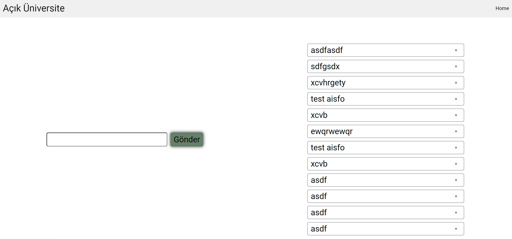
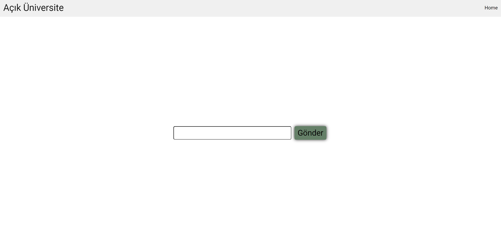
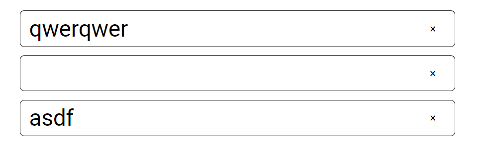
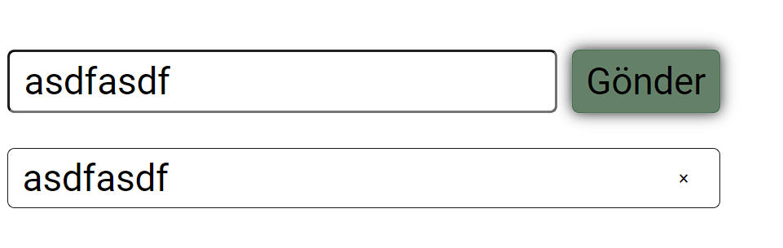

# Odev 1

### Ödev 1 - Yapılacaklar Listesi Eksiklikleri

Yaptığımız yapılacaklar listesi uygulamasında bazı eksiklikler ve hatalar var(`app.js`, `index.html` ve `style.css`).. Bu hataları sizden çözmenizi istiyorum.

1. Yazdığımız notlar belli bir sayıya ulaştığında ekran da kayma oluyor. Bunu düzeltmeliyiz.

   

2. Listemiz boş hali ile aşağıdaki gibi sayfanın tam ortasında duruyor ve her yeni not girdiğimiz de kayıyor. Bu kullanıcı deneyimi açısından hoş değil. Bu bölümü sabit bir yerde tutalım.

   

3. Uygulamamızda boş not girilebiliyor. Bunun için bir önlem almalıyız.

   

4. Yeni bir not girdiğimizde not girme alanımız temizlenmiyor. Bunu düzeltmeliyiz.

   

5. (Opsiyonel) Listemizde kayıt etme özelliği yok. Bunu yapabilirsek güzel olur. Bu kayıtlı notlar sayfamız yüklenince gelmeli.
6. (Opsiyonel) Yapılacak ekstra güzel eklentiler tabiki güzel karşılanır.

> **"Hocam ben kendim yapmak istiyorum" diyenler olabilir. Yukarıda hata ve eksik olarak belirttiğim durumlara dikkat ederek kendi uygulamalarını yapabilirler.**

### Ödev 2 - Hafıza Kart Oyunu (Opsiyonel)

Bir memory card game oyunumuz var (`memory-game.html`). Bu oyun için temel fonksiyonları sizlere veriyorum (`memoryGame.js`). Sizden ise bu oyun içinde:

1. Eşleştirme özelliği (Seçtiğimiz kart elemanımızdaki `data-name` özelliğini kullanarak yapabilirsiniz. İpucu `eleman.dataset` )
2. Oyun bitiş ekranı (Farklı bir html sayfası olmasına gerek yok. Oyunun bittiğini anlatması yeterlidir)
3. Oyun bittiğinde sayfanın yeniden yüklenerek oyuna tekrar başlanması

gibi özellikleri eklemenizi istiyorum.
